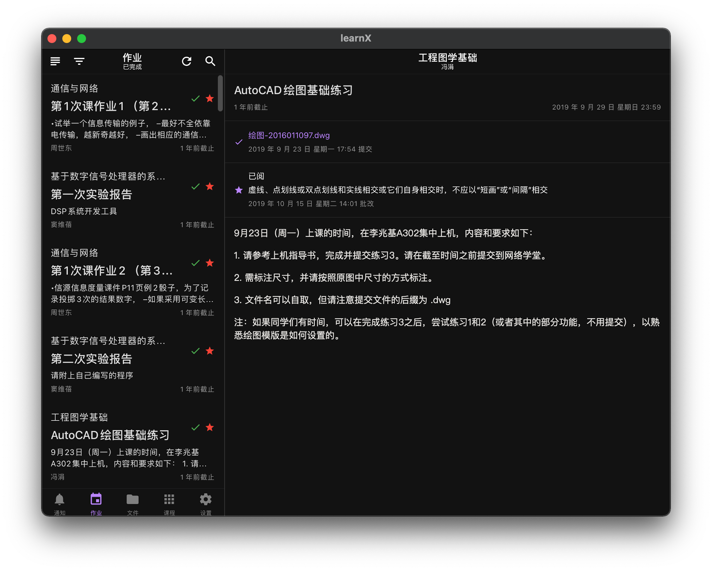

<h1>learnX</h1>

清华大学网络学堂 App，以 React Native 构建。

App for Tsinghua University Web Learning, developed with React Native. ⚛️

    
    

## 下载 Download

### 其他下载方式 Alternatives

#### Android

- **[TUNA 镜像（推荐） TUNA Mirror (recommended)](https://mirrors.tuna.tsinghua.edu.cn/github-release/robertying/learnX)**

- [GitHub Releases](https://github.com/robertying/learnX/releases)

## 功能 Features

> 注意：本应用只适用于清华大学学生。
>
> Note: the App is for Tsinghua University students only.

### 基础功能 Basic

- 第一时间看到老师最新发布的通知及其附件。

  Get a glance of the newest notices published by teachers.

- 预览或下载课程文件，将文件分享到其他应用。

  Preview or download uploaded files of each course.

- 一览作业要求，不错过任何 deadline，实时查询作业提交与批改情况。

  See any assignment detail while keeping track of deadlines.

### 高级功能 Advanced

- courseX 课程信息共享计划 Course Information Sharing
- 课表日历同步 Course schedule calendar sync
- 作业日历/提醒事项同步 Assignment calendar/reminder sync
- 归档内容 Archiving read posts
- 提交作业 Submitting assignments
- 收藏内容 Adding to Favorites
- 隐藏课程 Hiding courses
- 暗黑模式 Dark mode
- 全局搜索 Global search
- 切换学期 Switching among semesters

## 开源协议 License

以 MIT 许可证开源，但**不包含**下列情况：

- 您过去或者目前为清华大学信息化技术中心工作；
- 您的项目受到任何与清华大学有关的机构的经济资助。

如果上述任意条件成立，任何未经授权的对本项目中代码的使用将会被认为是侵权。上文中的“使用”包括对项目的源代码或衍生品制作拷贝、修改、重新分发，无论是否用作商业用途。

本项目中使用的开源项目则应用其自带的许可证。

---

MIT licensed, with the following restrictions:

For those

- who are working or have worked for Computer and Information Managing Center, Tsinghua University;
- whose project is financially supported by any institute in relation to Tsinghua University.

Any usage of code, without explicit authorizations from the author, from this project will be considered as infringement of copyright. The word "usage" may refer to making copies of, modifying, redistributing of the source code or any derivative of this project, for either commercial or non-commercial use.

Open source code used in this project is subjected to their own licenses.
