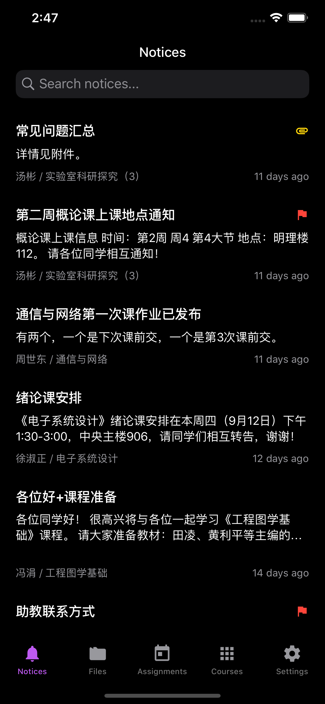
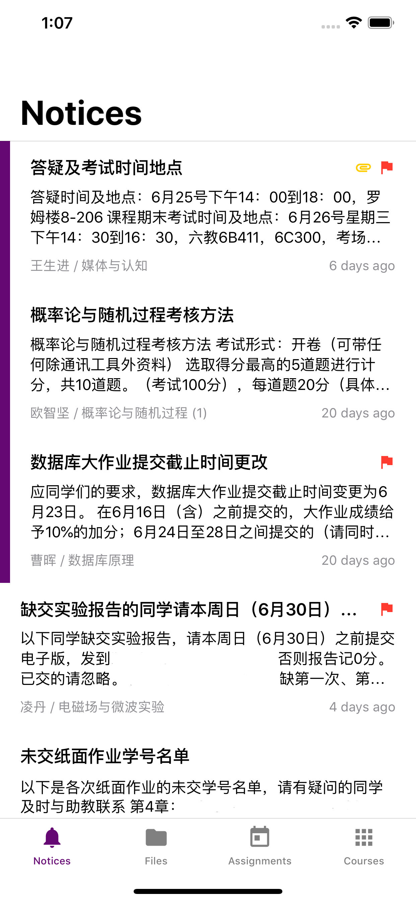

# learnX

清华大学网络学堂 App，以 React Native 构建。

App for Tsinghua University Web Learning, developed with React Native 🎉.

## Features

This project also serves as a demonstration of how to build a React Native app featuring:

- Latest React Native (0.61)
- Dark Mode on iOS / Dark Theme on Android
- AndroidX / CocoaPods
- Redux
- TypeScript
- Detox e2e tests (iOS)
- Continuous integration (Travis)
- Automatic deployment (Fastlane)

## Download

**Android users can also download the latest version from [GitHub Releases](https://github.com/robertying/learnX/releases).**

## License

以 MIT 许可证开源，但**不包含**下列情况：

- 您过去或者目前为清华大学信息化技术中心工作
- 您的项目受到任何与清华大学有关的机构的经济资助

如果上述任意条件成立，任何未经授权的对本项目中代码的使用将会被认为是侵权。上文中的“使用”包括对项目的源代码或衍生品制作拷贝、修改、重新分发，无论是否用作商业用途。

本项目中使用的开源项目则应用其自带的许可证。

---

MIT licensed, with the following restrictions:

For those

- who are working or have worked for Computer and Information Managing Center, Tsinghua University
- whose project is financially supported by any institute in relation to Tsinghua University

Any usage of code, without explicit authorizations from the author, from this project will be considered as infringement of copyright. The word "usage" may refer to making copies of, modifying, redistributing of the source code or any derivative of this project, for either commercial or non-commercial use.

Open source code used in this project is subjected to their own licenses.
