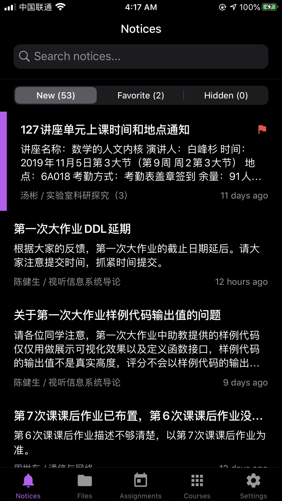

<h1>learnX</h1>

清华大学网络学堂 App，以 React Native 构建

App for Tsinghua University Web Learning, developed with React Native ⚛️

    
    

## Download

### Android Alternatives

- **[TUNA Mirror](https://mirrors.tuna.tsinghua.edu.cn/github-release/robertying/learnX)**

- [Self-hosted GitHub Release mirror (CDN)](https://app.robertying.io/download/learnX)

- [GitHub Releases](https://github.com/robertying/learnX/releases)

### macOS Alternatives

- [GitHub Releases](https://github.com/robertying/learnX/releases)

## App Features

### Basic

- Get a glance of the newest notices published by teachers.
- Preview or download uploaded files of each course.
- See any assignment detail while keeping track of deadlines.

### Advanced

- Push notifications (unofficial)
- Submit assignments
- Add to Favorites
- Set a reminder
- Hide courses
- Pin at the top
- Dark mode
- Course schedule calendar sync
- Deadline calendar sync
- Search
- Switch among semesters

## Project Features

This project also serves as a demonstration of how to build a React Native app featuring:

- Latest React Native (0.62)
- Mac Catalyst
- Dark Mode for iOS / Dark Theme for Android
- CocoaPods / AndroidX
- Redux
- TypeScript
- Detox e2e tests (iOS & Android)
- Continuous integration (Travis CI)
- Automatic deployment (Fastlane)

## License

以 MIT 许可证开源，但**不包含**下列情况：

- 您过去或者目前为清华大学信息化技术中心工作
- 您的项目受到任何与清华大学有关的机构的经济资助

如果上述任意条件成立，任何未经授权的对本项目中代码的使用将会被认为是侵权。上文中的“使用”包括对项目的源代码或衍生品制作拷贝、修改、重新分发，无论是否用作商业用途。

本项目中使用的开源项目则应用其自带的许可证。

---

MIT licensed, with the following restrictions:

For those

- who are working or have worked for Computer and Information Managing Center, Tsinghua University
- whose project is financially supported by any institute in relation to Tsinghua University

Any usage of code, without explicit authorizations from the author, from this project will be considered as infringement of copyright. The word "usage" may refer to making copies of, modifying, redistributing of the source code or any derivative of this project, for either commercial or non-commercial use.

Open source code used in this project is subjected to their own licenses.
