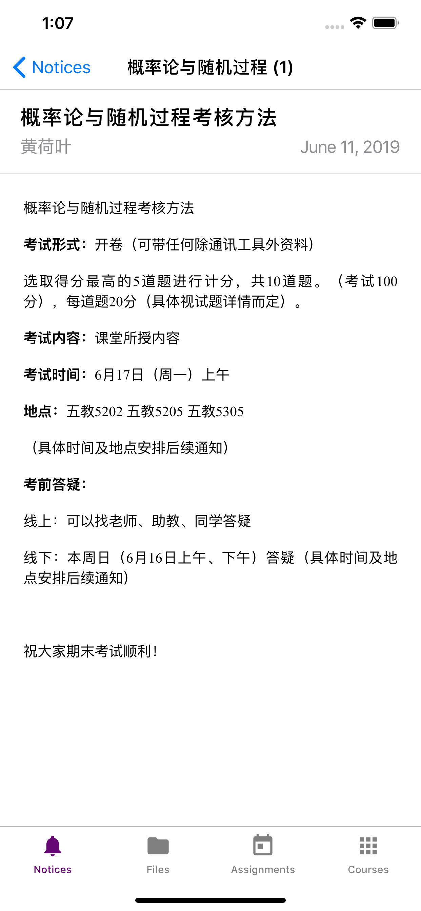

## 下载

&nbsp;&nbsp;&nbsp;

**Android 用户还可以从 [GitHub Releases](https://github.com/robertying/learnX/releases) 下载最新版本**

## 基础功能

- 第一时间看到老师最新发布的通知及其附件

- 预览或下载课程文件，将文件分享到其他应用

- 一览作业要求，不错过任何 deadline，实时查询作业提交与批改情况

## 高级功能

- Deadline 系统日历同步

- 滑动卡片以置顶

- 模糊搜索

- 暗黑模式

## 应用截图

    

    
    

    
    

## 反馈与建议

- 如果您已经拥有 GitHub 账户
  - 欢迎来 [issues](https://github.com/robertying/learnX/issues) 讨论新功能，反馈问题
- 如果您愿意获取最新的测试版本
  - iOS 用户可以选择参与 [TestFlight](https://testflight.apple.com/join/5SPCH86w)
- 您也可以在 App Store 中分享评论和反馈

## 隐私政策

[中文隐私政策](/cn/privacy)

[英文隐私政策](/en/privacy)

## 开源协议

以 MIT 许可证开源，但**不包含**下列情况：

- 您过去或者目前为清华大学信息化技术中心工作
- 您的项目受到任何与清华大学有关的机构的经济资助

如果上述任意条件成立，任何未经授权的对本项目中代码的使用将会被认为是侵权。上文中的“使用”包括对项目的源代码或衍生品制作拷贝、修改、重新分发，无论是否用作商业用途。

本项目中使用的开源项目则应用其自带的许可证。
